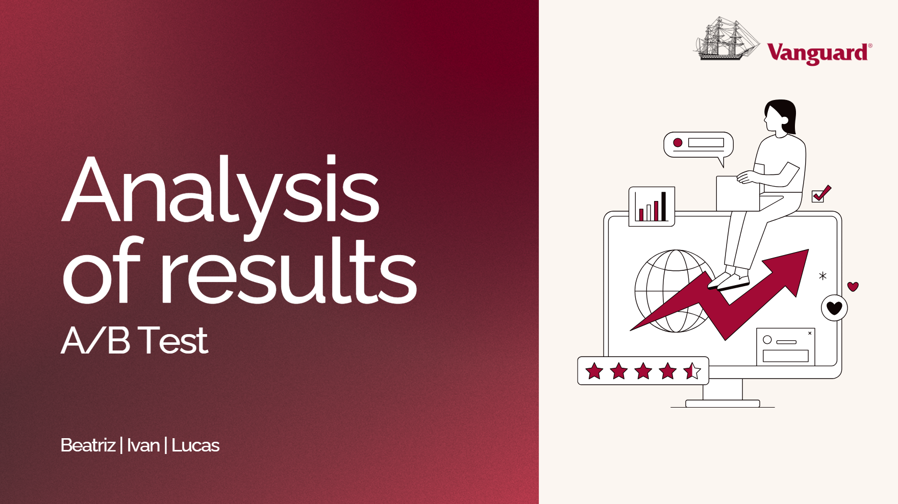
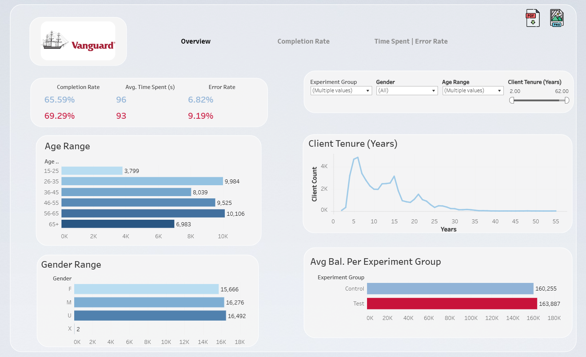

# Vanguard & The Digital Challenge

**Objective**: This project analyzes data from Vanguard’s A/B test, where a new user interface (UI) and in‐context prompts were introduced to increase the completion rate of an online process. We combine multiple datasets (demographics, web usage, and experiment assignments), clean and explore the data, and then conduct A/B test analyses to compare completion rates between the Test and Control groups. Along the way, we demonstrate statistical measures (e.g., mean, median, variance, and standard deviation) to illustrate how to interpret user behavior, understand variability, and gain insights into what drives higher completion rates.

---

## 1. Project Structure & Setup

- **Folders**:
  - `data/`: contains the four raw `.txt` files from GitHub.[https://github.com/data-bootcamp-v4/lessons/blob/main/5_6_eda_inf_stats_tableau/project/files_for_project/df_final_experiment_clients.txt]
[ https://github.com/data-bootcamp-v4/lessons/blob/main/5_6_eda_inf_stats_tableau/project/files_for_project/df_final_web_data_pt_1.txt]
[ https://github.com/data-bootcamp-v4/lessons/blob/main/5_6_eda_inf_stats_tableau/project/files_for_project/df_final_web_data_pt_2.txt]
[ https://github.com/data-bootcamp-v4/lessons/blob/main/5_6_eda_inf_stats_tableau/project/files_for_project/df_final_experiment_clients.txt]
  - `notebooks/`:icludes Jupyter notebooks for EDA, A/B testing, time spent, or `VsCode`  etc.
  - You’ll need to load each dataset and merge them to create a unified DataFrame for analysis.
 
    
- **Environment**:
  - Python 3.8+, recommended packages: `pandas`, `numpy`, `matplotlib`, `seaborn`,... etc.
- **How to Run**:
  1. Clone the repo
  2. Install dependencies: `pip install -r requirements.txt`
  3. Launch `notebooks/EDA_and_DataPrep.ipynb` in Jupyter or `VsCode` 
  4. Follow notebooks in suggested order as for other program.

---

## 2. Data Dictionary

| Column        | Description                                               |
|---------------|-----------------------------------------------------------|
| `client_id`   | Unique ID for each Vanguard client.                       |
| `process_step`| Step in the online process (start, step_1, step_2, etc.). |
| `variation`   | Experiment group: "Test" (new UI) or "Control" (old UI).  |
| `date_time`   | Timestamp of the client’s action or step transition.      |
| …             | …                                                         |

---

## 3. Analysis Steps Overview

### A. Data Loading & Merging
- Summaries of how we load and combine data (pd.concat, pd.merge).

### B. Cleaning & EDA
- Checking missing values, duplicates, outliers, data types.

### C. A/B Test Analysis
- Calculating completion rates, performing chi-square tests, etc.

### D. Time Spent Analysis
- Use `groupby` and `diff()` to calculate the time spent at each step.

### E. Tableau Dashboard
- Summaries of how we built interactive visuals (completion rates, time per step, demographic filters).

---

## 4. Key Results

- **Test group completion**: ~69.29%
- **Control group completion**: ~65.59%
- **Time spent**: The Test group was faster on Step 1 but slower on Steps 2 & 3, etc.
- Conclusion: The new UI shows a modest improvement in overall completion rate.

---

## 5. Next Steps & Limitations

- **Limitations**: High proportion of unknown `gender`, outliers in time data, some missing client IDs.
- **Future Work**:
  - Further segmentation by client tenure or account balance
  - Additional A/B tests with refined UI
  - Incorporation of direct user feedback or reasons for dropout

---

## 6. Visualization Features

In this project, we employed several visualization techniques to illustrate key insights and trends:

1. **Dashboard Construction**:
 
   - Imported the clean and processed dataset for further analysis.
   - Creating a comprehensive dashboard that includes key metrics of A/B test outcome such as completion rates, time spent on each step, error rates as well         as if there are gender differences affecting engaging with the new or old process.

3. **Histograms**  
   - **Purpose**: Show the distribution of a single numerical variable (e.g., age, balance, logons).  
   - **Example**: Understanding how user ages are distributed or if balances are skewed.

4. **Boxplots**  
   - **Purpose**: Identify outliers and compare distributions across groups (e.g., Test vs. Control).  
   - **Example**: Quickly see if the Test group has a broader range of time‐spent values compared to the Control group.

5. **Bar Charts**  
   - **Purpose**: Compare discrete categories, such as completion rates between Test and Control.  
   - **Example**: Display that the Test group has a 69.29% completion rate vs. the Control group’s 65.59%.

6. **Visual clarity and context(Tableau)**  
   - **Purpose**: Integrated EDA Visualization for clearer communication and understanding of experiment results. 
   - **Example**: Completion Rate Table,Time Spent on Each Step BarPlot etc.

7. **Interactivity**  
   - **Purpose**: Used filtering and drilling features to let users explore data by demographics.
   - **Example**: Age and gender.

8. **Heatmaps or Correlation Plots**  
   - **Purpose**: Visualize relationships between multiple numeric variables (e.g., age, tenure, balance, logins).  
   - **Example**: Reveal if older clients tend to spend longer on certain steps or if higher balance clients convert at different rates.

9. **Interactive Dashboards (Tableau)**  
   - **Purpose**: Combine multiple charts (bar, funnel, boxplots) into one dashboard.  
   - **Features**: Filtering by demographics (age, gender) or date range, parameter controls for selecting different KPIs or segments, etc.

## Project Overview 

Goal: Determine if the new, modern interface (Test group) yields a higher process completion rate compared to the traditional interface (Control group).

Datasets:

1-Client Profiles (df_final_demo): Demographics (age, gender, tenure, etc.).

2-Digital Footprints (df_final_web_data): Detailed online interactions, split into two parts (pt_1 & pt_2).

3-Experiment Roster (df_final_experiment_clients): Identifies whether a client is in the Control or Test group.